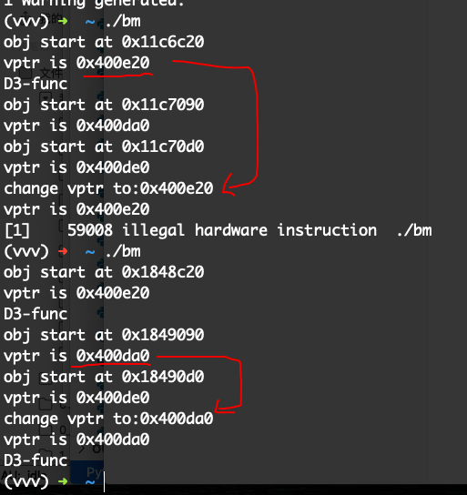

# CFI_benchmark


Here is a Sample Usage on LLVM-CFI:


```
clang++ -o bm -flto -fsanitize=cfi -fvisibility=hidden benchmark.cpp

(vvv) ➜  ~ ./bm
obj start at 0x11c6c20
vptr is 0x400e20
D3-func
obj start at 0x11c7090
vptr is 0x400da0
obj start at 0x11c70d0
vptr is 0x400de0
change vptr to:0x400e20
vptr is 0x400e20         # LLVM-CFI stops the vcall hijacking toward other::double_the_size()
[1]    59008 illegal hardware instruction  ./bm


(vvv) ➜  ~ ./bm
obj start at 0x1848c20
vptr is 0x400e20
D3-func
obj start at 0x1849090 # D3 obj
vptr is 0x400da0
obj start at 0x18490d0 # D2 obj
vptr is 0x400de0
change vptr to:0x400da0 # change D2 obj vptr toward D3's vtable
vptr is 0x400da0
D3-func               # Control Flow Distort is not stopped by LLVM-CFI, cooplus succeed ...
```





